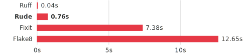

<h1 align="center">
  
</h1>

<p align="center">
  <a href="https://github.com/rude-dev/rude/blob/main/LICENSE"></a>
  <a href="https://pypi.org/project/rude/"></a>
  <a href="https://pypi.org/project/rude/"></a>
</p>

<p align="center">
  <strong>A fast, extensible Python linter for custom rules.</strong><br/>
  Complements <a href="https://github.com/astral-sh/ruff">Ruff</a> by letting you
  write custom lint rules in Python — with Rust-powered analysis under the hood.<br/>
  <strong>17x faster</strong> than Flake8 single-threaded. Custom lint rules in Python, with Rust-powered analysis.
</p>

<p align="center">
  <picture>
    <source media="(prefers-color-scheme: dark)" srcset="docs/_static/benchmark-tier1.svg"/>
    
  </picture>
  <br/>
  <sub>Linting Django (901 files) -- 10 equivalent AST rules, single process</sub>
</p>

---

## Getting started

```bash
# Lints the current workdir
$ uvx rude check

$ uv tool install rude
$ rude --version
rude 0.1a2


# Add rude to your project
uv add rude --dev
```

## Write your first rule

```python
from rude import Rule, Node, NodeType, Diagnostic
from collections.abc import Iterator

class NoDebugPrint(Rule):
    code = "DBG001"
    message = "Debug print() found"
    node_types = {NodeType.CALL}

    def check(self, node: Node) -> Iterator[Diagnostic]:
        if node.function_name == "print":
            yield self.diagnostic(node)
```

Two base classes: `Rule` (AST nodes) and `LineRule` (raw text). Rules can
provide autofixes with import management.

Register as a plugin or as local rules:

```toml
# pyproject.toml
[project.entry-points."rude.plugins"]
my_plugin = "my_plugin"

[tool.rude]
local-rules = ["tools/linting/rules.py"]
```

## Key features

- **Severity levels** -- ERROR breaks CI, WARNING doesn't. Four levels (error, warning, info, hint) per rule, filterable with `--quiet`.
- **Template rules** -- lint without writing Python. Ban calls, require base classes, enforce decorators -- all from `pyproject.toml`.
- **Autofix with imports** -- `Fix.replace(node, text, imports_from=[...])` handles insertion, deduplication, and placement automatically.
- **Fast** -- Rust-powered tree-sitter parsing and semantic analysis. Streaming pipeline keeps memory flat across a project (buffered when `--fix` rewrites files); the GIL is released during per-file Rust analysis.
- **Rich Node API** -- `node.function_name`, `node.inherits_from("Base")`, `node.decorator_names`. No raw tree-sitter needed.
- **104 built-in rules** -- pyflakes (F), pycodestyle (E/W), McCabe (C901). Additional rule sets can be added via third-party plugins or local Python rule files.

## The sweet spot

| | Standard rules | Custom rules | Speed | Memory | Severity |
|---|---|---|---|---|---|
| **Ruff** | 800+ | none | fastest | low | all fatal |
| **Rude** | 104 + plugins | unlimited | fast | low | 4 levels |
| **Flake8** | 100+ (plugins) | via packages | slow | medium | all fatal |
| **Fixit** | ~30 | via LibCST | slow | high | all fatal |
