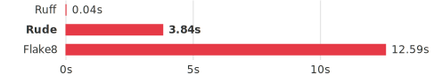

# Why being rude?

Fair question. Here's how Rude compares to Flake8 and Fixit — the tools it
replaces — and how it complements Ruff.

## At a glance

| | **Rude** | **Ruff** | **Flake8** | **Fixit** |
|---|---|---|---|---|
| Language | Python + Rust (PyO3) | Rust | Python | Python (LibCST) |
| Parser | tree-sitter (vendored in Rust) | custom Rust | stdlib AST + tokenizer | LibCST (CST) |
| **Custom rules in Python** | **yes** | **no** | yes (plugins) | yes (local rules) |
| Built-in rules | 104 (+ 43 via plugins) | 800+ | ~100 (+ plugin ecosystem) | ~30 |
| Autofix | yes | yes | no | yes (CST-aware) |
| Formatter | no | yes | no | no |
| Error recovery | yes | yes | no | no |
| Semantic analysis | yes (Rust) | partial | no | no |
| Parallel execution | yes | yes | yes | no |
| Incremental cache | no | yes | no | no |
| Configuration | pyproject.toml | pyproject.toml / ruff.toml | .flake8 / setup.cfg | pyproject.toml (hierarchical) |

## Performance

### Reference results

The numbers below come from a single benchmark run on a dedicated machine with
no other workload. Results may vary on your hardware — run the benchmark
yourself to get local numbers (see Methodology below).

:::{admonition} The headline number
:class: tip

Rude lints 901 Django files in **0.76s / 64 MB** in its default single-process
mode. Flake8 takes **13.0s** single-threaded on equivalent AST rules -- **17x
slower**. Even with all 16 CPUs, Flake8 only reaches 1.64s.
:::

**Tier 1 — AST-semantic rules (3-way, 10 equivalent rules)**

```{raw} html
<p align="center">
  
  <br/>
  <sub>Django (901 files) — 10 equivalent rules, single process</sub>
</p>
```

| Tool | Jobs | Wall time | Memory | Diags | LOC/s |
|---|---|---|---|---|---|
| **Rude** | 1 | **0.76s** | 64 MB | 220 | 212,746 |
| **Rude** | auto | **0.74s** | 63 MB | 220 | 218,724 |
| Flake8 | 1 | 13.03s | 49 MB | 0 | 12,445 |
| Flake8 | auto | 1.64s | — | 0 | 98,599 |
| Ruff | auto | 0.06s | 103 MB | 492 | 2,810,679 |

Flake8 single-threaded is **17x slower** than Rude (13.0s vs 0.76s). Even with
all 16 CPUs (auto), Flake8 at 1.64s is still slower than Rude on a single
process. Rude's speed comes from Rust-powered tree-sitter parsing, semantic
analysis, and pre-computed line metadata via rayon.

**Tier 2 — Full E/W/F/C rules (Rude vs Flake8, ~104 rules)**

```{raw} html
<p align="center">
  
  <br/>
  <sub>Django (901 files) — ~104 rules, single process</sub>
</p>
```

| Tool | Jobs | Wall time | Memory | Diags | LOC/s |
|---|---|---|---|---|---|
| **Rude** | 1 | **4.02s** | 67 MB | 5,058 | 40,297 |
| **Rude** | auto | **4.00s** | 69 MB | 5,058 | 40,549 |
| Flake8 | 1 | 13.51s | 50 MB | 5,267 | 12,000 |
| Flake8 | auto | 1.76s | — | 5,267 | 92,290 |
| Ruff | auto | 0.04s | 1 MB | 527 | 4,148,421 |

Flake8 single-threaded is **3.4x slower** than Rude (13.5s vs 4.0s). With all
16 CPUs, Flake8 at 1.76s overtakes single-process Rude -- this is where
`--jobs=N` matters. The bottleneck is Python rule execution (see parallelism
model below).

**Parallel scaling.** Rude's `--jobs=N` enables subprocess parallelism for
Python rules. In Tier 1 (10 lightweight AST rules), the Rust rayon pipeline
handles most of the work -- `--jobs` has minimal effect. In Tier 2 (~104 Python
rules), `--jobs=N` provides near-linear scaling as Python rule execution
dominates. Run `benches/comparative/compare.py --jobs 1,2,4,8,16` for detailed
scaling data on your hardware.

**Throughput -- large corpus (162k LOC)**

| Tool | Tier 1 (LOC/s) | Tier 2 (LOC/s) |
|---|---:|---:|
| Rude (1j) | 213k | 40k |
| Flake8 (1j) | 12.4k | 12.0k |
| Flake8 (auto) | 99k | 92k |

Rude single-threaded sustains **213k LOC/s** on tier 1 -- Flake8 manages 12.4k
(**17x less**). On tier 2 with ~104 Python rules, Rude processes **40k LOC/s**
vs Flake8's 12.0k (**3.4x less**).

:::{note}
**About diagnostic counts.** Rude reports 5,058 diagnostics on Django (tier 2)
while Flake8 reports 5,267. Each tool implements a slightly different subset of
the E/W/F/C rules, with different defaults for edge-case behavior. Tier 1 counts
are closer (Rude: 220, Flake8: 260) because those 10 rules are the most
standardized.
:::

**Startup latency (1 file, 1 LOC)**

| Tool | Wall time | Memory |
|---|---|---|
| **Rude** | **90 ms** | 56 MB |
| **Ruff** | **90 ms** | 44 MB |
| **Flake8** | 120 ms | 62 MB |
| **Fixit** | 280 ms | 71 MB |

### Interpretation

Rude is the fastest Python-extensible linter available. On AST-semantic rules
(Tier 1), a single Rude process lints Django in **0.76s** -- Flake8 needs
**13.0s** single-threaded (17x slower) or **all 16 CPUs** to reach 1.64s
(still slower than single-process Rude).

On full E/W/F/C rules (Tier 2), Flake8 single-threaded is **3.4x slower** than
Rude (13.5s vs 4.0s). With all CPUs, Flake8 at 1.76s overtakes single-process
Rude -- this is where `--jobs=N` matters for Rude as well, enabling subprocess
parallelism for Python rules.

Ruff is in a class of its own for raw throughput -- it's pure Rust with no
Python overhead. Since it doesn't support custom rules, Rude is designed as
a complement: Ruff for standard checks, Rude for your own.

### Methodology

The benchmark uses `benches/comparative/compare.py`, which runs each tool as an
independent subprocess with per-process CPU time measurement (via
`resource.getrusage` deltas) and peak memory tracking (via `psutil` polling the
specific child PID). No tool is given an unfair advantage -- all share the
same constraints:

**Corpus.** Real-world Python projects downloaded from GitHub:

| Corpus | Source | Files | LOC |
|---|---|---|---|
| large | django/django | 901 | 162,163 |
| huge | home-assistant/core | 8,910 | 1,309,498 |

**Rule selection.** Two tiers ensure both narrow and broad comparisons:

- **Tier 1** -- 10 AST-semantic rules that all tools implement:
  `E711, E712, E721, E722, E731, E741, E401, F631, F901, C901`.
- **Tier 2** -- All `E`, `W`, `F`, `C` rules. Fixit is excluded
  because it does not implement pycodestyle or pyflakes checks.

**Tool invocation.** Each tool is run via subprocess to include real-world
startup cost. Parallelism is tested at `--jobs=1` (single process) and
`--jobs=auto` (default, usually all CPUs for flake8, single process for rude).

**Timing.** Wall-clock time is measured with `time.monotonic()`. CPU time uses
`resource.getrusage(RUSAGE_CHILDREN)` deltas (before/after each subprocess) for
accurate per-process measurement. Peak RSS is sampled via `psutil.Process(pid)`
in a background thread at 50ms intervals. Each configuration is run 5 times;
the tables report the **median**.

**Internal benchmarks.** In addition to the comparative benchmark, the project
includes:

- **criterion** (Rust) -- benchmarks for `do_analyze_result`,
  `compute_line_infos`, `compute_style_flags`, `collect_grouped_nodes`
- **pytest-benchmark** (Python) -- benchmarks for `analyze_source`,
  `group_nodes`, `Linter.check_file`, `NodeProxy` patterns

**Test environment.**

| | |
|---|---|
| CPU | Intel Core i9-9900K @ 3.60 GHz (8 cores / 16 threads) |
| RAM | 32 GB DDR4 |
| Storage | NVMe (Corsair MP600 PRO) |
| OS | Debian (Linux 6.1.0-42-amd64) |
| Python | 3.11.2 |
| Rude | 0.1a2 |
| Flake8 | 7.3.0 |

**Reproduce.** Run the benchmarks on your own hardware:

```
# Download the corpus
uv run python benches/corpus/download.py

# Comparative benchmark (rude vs flake8 vs ruff)
uv run --group bench python benches/comparative/compare.py --output results.json

# Rust internal benchmarks (criterion)
cargo bench

# Python internal benchmarks (pytest-benchmark)
uv run --group bench pytest benches/python/ --benchmark-only -v
```

See `benches/comparative/compare.py --help` for options (corpus selection, job
counts, number of runs).

(parallelism-model)=
## Parallelism model

Rude's architecture splits work between Rust and Python:

```text
┌────────────────────────────────────┐
│         Single process (default)   │
│                                    │
│  ┌──────────────────────────────┐  │
│  │  Rust rayon (all CPUs)       │  │
│  │  · File I/O                  │  │
│  │  · tree-sitter parsing       │  │
│  │  · Semantic analysis         │  │
│  │  · Pre-computed line metadata│  │
│  └──────────┬───────────────────┘  │
│             │ yields results       │
│  ┌──────────▼───────────────────┐  │
│  │  Python (main thread)        │  │
│  │  · Line rules                │  │
│  │  · AST rules                 │  │
│  └──────────────────────────────┘  │
│  Memory: ~67 MB (constant)         │
└────────────────────────────────────┘
```

The default mode keeps memory low because only one Python process exists, and
rayon streams results through a bounded channel (capacity 8) so at most a few
files are materialized at any time.

The bottleneck is [Amdahl's law](https://en.wikipedia.org/wiki/Amdahl%27s_law):
rayon parallelizes the Rust phases across all CPUs, but Python rules are
serialized by the GIL. As the number of Python rules grows (Tier 2 has ~104),
the serial Python fraction dominates wall time.

`--jobs=N` breaks through the GIL by spawning N subprocesses:

```text
┌──────────────────────────────────────────────┐
│         --jobs=N (multiprocess)               │
│                                               │
│  ┌──────────┐  ┌──────────┐     ┌──────────┐ │
│  │ Worker 1 │  │ Worker 2 │ ... │ Worker N │ │
│  │ rayon    │  │ rayon    │     │ rayon    │ │
│  │ Python   │  │ Python   │     │ Python   │ │
│  └──────────┘  └──────────┘     └──────────┘ │
│  Memory: ~N × 67 MB                          │
└──────────────────────────────────────────────┘
```

Each worker gets a balanced chunk of files (LPT scheduling by file size) and
runs the full pipeline independently. Rayon threads per worker are automatically
scaled to `cpu_count / N` so the total thread count matches the available cores.

### When to use `--jobs`

| Scenario | Recommendation |
|---|---|
| Any codebase | Default (`--jobs=1`) — single process, ~67 MB flat footprint |
| Large codebase, max speed | `--jobs=$(nproc)` — one worker per CPU |
| CI with max speed priority | `--jobs=$(nproc)` — all CPUs, but N × memory |
| Specific worker count | `--jobs=4` — explicit control for reproducible benchmarks |

### Why not Python threads?

Python's GIL (Global Interpreter Lock) prevents parallel execution of Python
bytecode within a single process. Since lint rules are CPU-bound Python code,
threading would add overhead without parallelism. Multiprocessing is the only
way to achieve true Python parallelism with CPython.

:::{note}
[Free-threaded Python](https://docs.python.org/3.13/whatsnew/3.13.html#free-threaded-cpython)
(3.13t+) removes the GIL and could eventually allow thread-based parallelism
for Python rules — shared memory with no subprocess overhead. This is not yet
supported as the ecosystem (PyO3, extensions) is still maturing.
:::

## Extensibility

| | **Rude** | **Ruff** | **Flake8** | **Fixit** |
|---|---|---|---|---|
| **Write rules in Python** | **yes** | **no** | yes | yes |
| Local rules (no package needed) | yes | no | no | yes |
| Plugin system | entry points | n/a | entry points | module paths |
| Configurable rule templates | yes | no | no | no |
| Rule types | AST, Line | Rust only | AST, logical line, physical line | CST visitor |
| Test helpers for rules | yes (`assert_fix`, `assert_no_fix`) | n/a | no | yes (inline VALID/INVALID) |

**Rude** and **Fixit** are the best choices when you need project-specific rules.
Rude offers configurable templates (`RequireBaseClass`, `ForbiddenCall`, etc.)
that cover common patterns without writing code. Fixit provides inline test
cases and CST-aware transforms. Flake8 requires publishing a plugin package.
Ruff does not support custom rules at all — Rude fills that gap.

## Semantic analysis

| Capability | **Rude** | **Ruff** | **Flake8** | **Fixit** |
|---|---|---|---|---|
| Scope resolution | yes (Rust) | partial | no | no |
| Binding tracking | yes (Rust) | partial | no | no |
| Qualified name resolution | yes | no | no | no |
| Ancestor context flags | yes (`CTX_IN_LOOP`, etc.) | no | no | no |
| Unused import detection | yes (semantic) | yes | yes (pyflakes) | no |
| Undefined name detection | yes (semantic) | yes | yes (pyflakes) | no |

Rude's `SemanticModel` is built in Rust and exposed via PyO3. It resolves
scopes, bindings, and references in a single pass, giving rules access to
information like "is this variable used?" or "what does this name resolve to?"
without re-parsing.

## Auto-fix quality

| | **Rude** | **Ruff** | **Flake8** | **Fixit** |
|---|---|---|---|---|
| Fix mechanism | byte-level edits | byte-level edits | none | CST transforms |
| Import management | yes | yes | no | no |
| Preserves formatting | partial | partial | n/a | yes (CST) |
| Fix conflicts resolved | yes (atomic, non-overlapping) | yes | n/a | yes |

Fixit has the most precise auto-fix thanks to LibCST concrete syntax tree
transforms. Rude and Ruff use byte-range edits, which are fast but less
format-aware. Rude adds import management to fixes (e.g., a rule can add
`import logging` when replacing `print()` with `logger.debug()`).

## Built-in rule coverage

| Category | **Rude** | **Ruff** | **Flake8** | **Fixit** |
|---|---|---|---|---|
| Pyflakes (F) | yes | yes | yes | no |
| Pycodestyle (E/W) | yes | yes | yes | no |
| McCabe complexity (C) | yes | yes | yes | no |
| Import sorting | no | yes | plugin (isort) | no |
| Code modernization (UP) | yes (partial) | yes | plugin (pyupgrade) | partial |
| Security (S/bandit) | partial (eval/exec) | yes | plugin (bandit) | no |
| Bug prevention (B) | yes (partial) | yes | plugin (bugbear) | partial |
| Comprehension simplification (C4) | yes | yes | no | no |
| Code smells (PAT) | yes | no | no | no |
| Hygiene (META) | yes | no | no | no |
| Configurable templates (EX) | yes | no | no | no |

Ruff has by far the largest built-in rule set (800+), re-implementing rules from
50+ Flake8 plugins. Rude focuses on the core checks (pyflakes, pycodestyle,
complexity) plus unique categories like code smells, hygiene, and configurable
templates that no other tool provides. Fixit ships only ~30 rules and is
primarily a *framework* for writing your own. Flake8 requires third-party
plugins for most categories beyond pycodestyle and pyflakes.

## Monorepo support

| | **Rude** | **Ruff** | **Flake8** | **Fixit** |
|---|---|---|---|---|
| Hierarchical config | no | partial (per-file-ignores) | no | yes |
| Per-directory rules | via local-rules | no | no | yes |
| Per-file overrides | via `# noqa` | via per-file-ignores | via `# noqa` | via config |

Fixit was designed at Meta specifically for large monorepos with per-team
configuration. Ruff supports `per-file-ignores` for selective rule disabling.
Rude supports `local-rules` paths but does not yet have hierarchical config
files.

## When to use what

### Use Ruff when...
- You want maximum speed with zero configuration.
- Standard rules (PEP 8, import sorting, code modernization) cover your needs.
- You want a single tool replacing flake8 + black + isort + pyupgrade.

### Use Rude when...
- You need **custom rules** specific to your project or organization.
- You want **semantic analysis** (scopes, bindings) available in Python rules.
- You want **configurable rule templates** without writing code.
- You already use Ruff for standard checks and need a complement for custom ones.

### Use Fixit when...
- You need **CST-aware auto-fixes** that precisely preserve formatting.
- You work in a **monorepo** with per-team hierarchical configuration.
- You want the lowest boilerplate for writing rules (inline test cases).

### Use Flake8 when...
- You have an existing investment in **Flake8 plugins** that aren't yet in Ruff.
- Your team is familiar with the tool and migration cost isn't justified.

## Using Rude alongside Ruff

Rude is designed to complement Ruff, not replace it. A typical setup:

```bash
# Ruff handles standard checks + formatting
ruff check src/ && ruff format src/

# Rude handles custom organization rules
rude check src/
```

```toml
# pyproject.toml
[tool.ruff.lint]
select = ["E", "F", "I", "UP", "B", "SIM"]

[tool.rude]
select = ["PAT", "META", "EX"]
local-rules = ["tools/lint/rules.py"]
```
